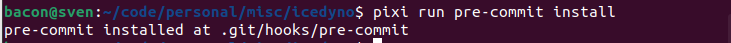
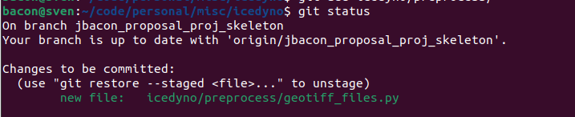
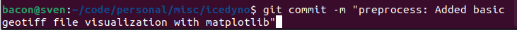
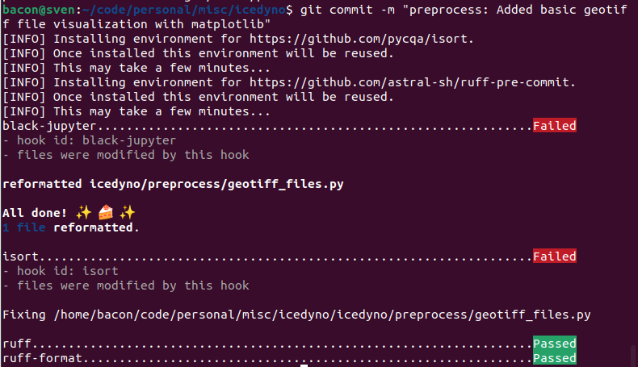
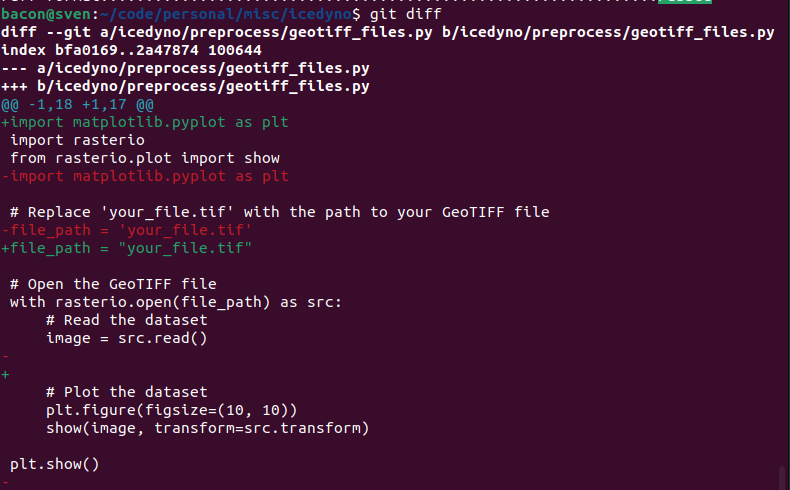
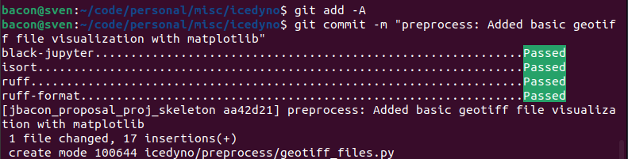

# Setup
To get started, clone the repo, checkout this branch, using Linux or Mac install pixi with:
```curl -fsSL https://pixi.sh/install.sh | bash```

If using windows, install pixi with:
```iwr -useb https://pixi.sh/install.ps1 | iex```

See here for more info on pixi: https://pixi.sh/

Then to install the project and its dependencies, type:
```pixi install```

You could activate the virtual environment with `pixi shell` or every time you want to use the environment, prefix your commands with `pixi run` inside the icedyno project folder (ex: `pixi run pytest`).

To set up the automatic linters (that run every time you commit your work), you would run:
```pixi run pre-commit install```



## Testing the set up
If you activated the pixi environment, type `pytest`. If not, type `pixi run pytest`. You should have one dummy test that runs on that command.

## Linters and pre-commit hooks
After you've installed the pre-commit hooks and have changes to commit, this is what the process will look like for committing:

1. You have changes to commit:


2. Commit with a descriptive message:


3. One-time setup of the linters:


4. Our code was not already compliant with the linters, so they "failed" our commit and automatically changed things about our code to become compliant:


5. Go ahead and inspect what got modified if you'd like:


6. Add the changes and redo your commit command:
 