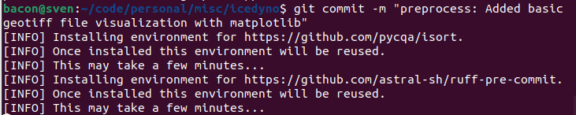

# Setup
To get started, clone the repo, checkout this branch, using Linux install pixi with:  
```curl -fsSL https://pixi.sh/install.sh | bash```

For Mac, install via homebrew with
```brew install pixi```

If using windows, install pixi with:  
```iwr -useb https://pixi.sh/install.ps1 | iex```

See here for more info on pixi: https://pixi.sh/.

Then to install the project and its dependencies, type:  
```pixi install```

You could activate the virtual environment with `pixi shell` (so every command uses the virtual environment until you type `exit`) or prefix your commands with `pixi run` inside the icedyno project folder (ex: `pixi run pytest`).

To set up the automatic linters (that run every time you commit your work), you would run:  
```pixi run pre-commit install```


Finish the installation proces with:  
```pixi run pip install -e .```

If you skip this last step, you will **not** be able to import `icedyno` as an installed python library. 

## Testing the set up
If you activated the pixi environment, type `pytest`. If not, type `pixi run pytest`. You should have one dummy test that runs on that command.

## What does it look like when the linters and pre-commit hooks run?
After you've installed the pre-commit hooks and have changes to commit, this is what the process will look like for committing:

1. You have changes to commit:  


2. Commit with a descriptive message:  


3. One-time setup of the linters:  


4. Our code was not already compliant with the linters, so they "failed" our commit and automatically changed things about our code to become compliant:  


5. Go ahead and inspect what got modified if you'd like:  


6. Add the changes and redo your commit command:  
 

## Adding new dependencies
Just write ```pixi add conda_or_pip_package_name```. You can add multiple dependencies at once (which is better than one at a time, `pixi` will have to recompute work otherwise) by adding a space between the package names. I.e. `pixi add package1 package2 package3`.

You'll see that the `pixi.toml` and `pixi.lock` files will change after adding your new dependencies -- make sure to add those changes in your next commit!

## Removing a dependency
```pixi remove package_name```


# Documentation
Mkdocs is the documentation engine that takes hand-written markdown files to a project website.
Please read more at https://www.mkdocs.org/.

Mkdocstrings is a mkdocs extension that allows autogenerated documentation to be made, by scraping type hints and documentation strings for any python modules within the project.

## Building and serving the documentation commands locally

* `mkdocs new [dir-name]` - Create a new project.
* `mkdocs serve` - Start the live-reloading docs server.
* `mkdocs build` - Build the documentation site.
* `mkdocs -h` - Print help message and exit.

## Documentation files layout

    mkdocs.yml    # The configuration file.
    docs/
        images/   # Folder for storing local images for documentation, including for the README.md.
        index.md  # The documentation homepage.
        ...       # Other markdown pages.

### Add a new page or subpage
To add a new page, in `mkdocs.yml` add the page (or subpage) by:
```
site_name: IceDyno Documentation

nav:
  - Home: index.md
  - Setup: setup.md
  - New Page: newpage.md
    - New SubPage: newsubpage.md
    - ...
```

### Autogenerate documentation for an IceDyno module

Add to a markdown file something like this:
`::: icedyno.preprocess`